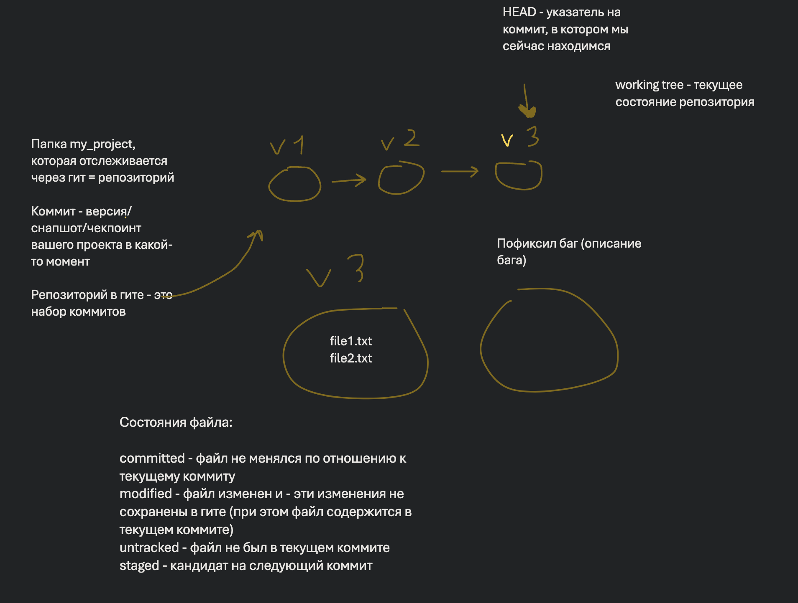
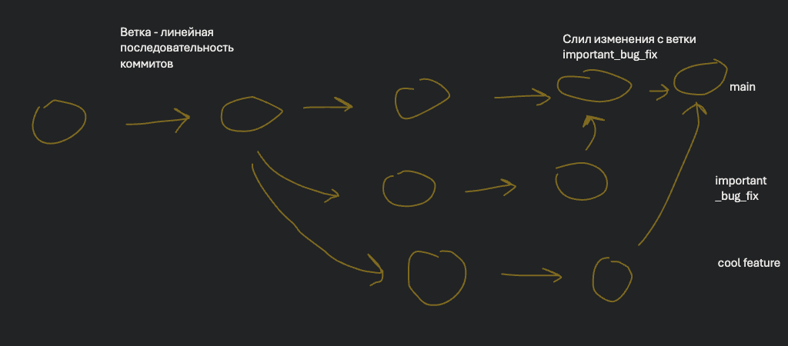

- Основные концепции гита
  - Репозиторий в гите - это набор коммитов, каждый коммит - “чекпоинт” проекта (норм это все показывать в виде рисунка). Базовый вариант - линейная последовательность коммитов
  - HEAD - указатель на коммит, в котором мы находимся
  - working tree - текущее состояние репозитория
  - Есть несколько состояний, в которых могут находится файлы в репозитории: committed, modified, untracked, staged.
    - committed - состояние файла соответствует последнему коммиту
    - modified - файл был в прошлом коммите, но изменен
    - untracked - файл не был в прошлом коммите
    - staged - изменения файла будут добавлены в новый коммит

- Базовые операции: `git init`, `git status`, `git add`, `git commit`, `git log`
- Удобный способ использовать гит - IDE вроде VSCode или PyCharm/Intellij и тд (для VSCode я люблю расширение [Git Graph V3](https://marketplace.visualstudio.com/items?itemName=Gxl.git-graph-3))

- Ветки, команды `git checkout`, `git merge`

- Работа с облаком через GitHub, `git clone`, `git push`, `git pull`, `git fetch`, `git remote add`, пулл реквесты

- Бонус
    - Удобные команды: `git stash`, `git cherrypick`, `git revert`, `git commit --amend`

Сопровождающие лекции: [Методология разработки ПО](../lectures/development.md) и [CI/CD](../lectures/cicd.md)
